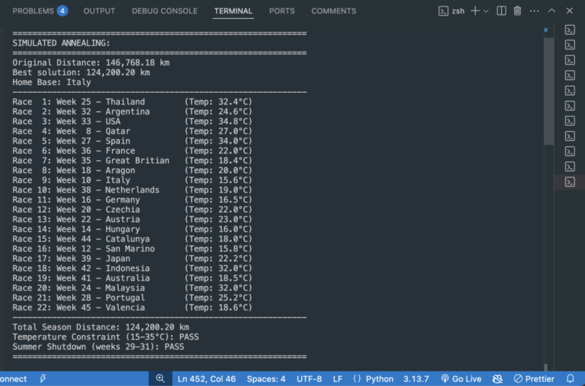
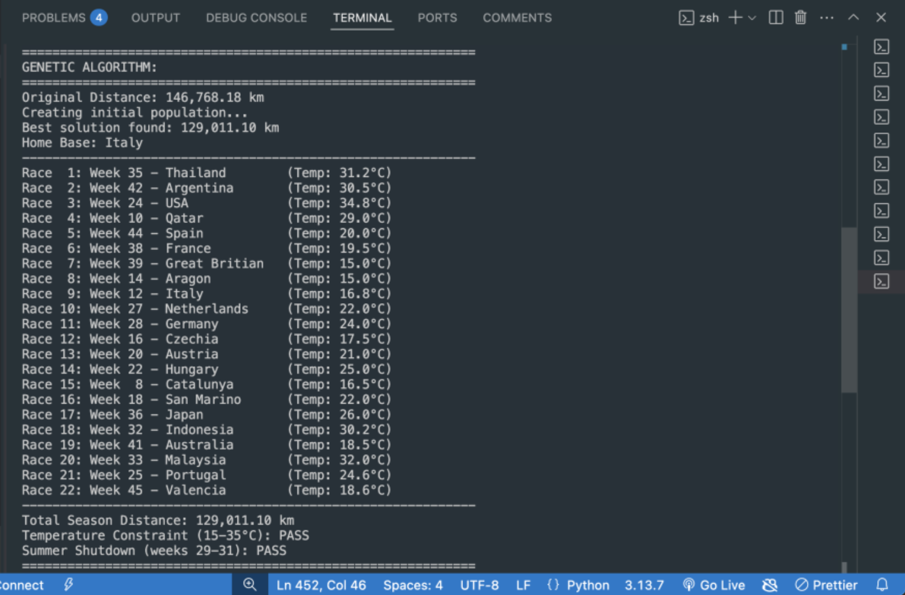
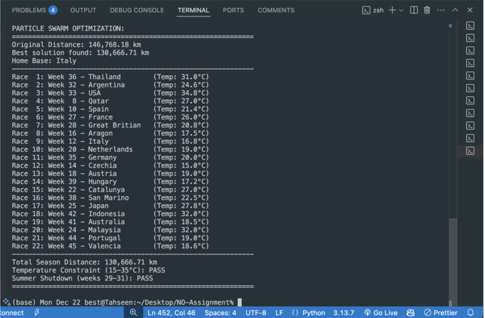
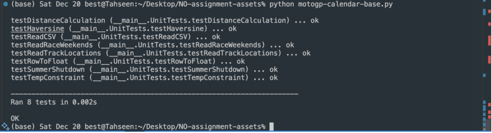

# MotoGP Calendar Optimisation

## Introduction

This project applies three numerical optimisation techniques to the MotoGP racing calendar problem. Racing teams travel globally across 22 races each season, generating significant travel distances and associated costs. The goal is to find an optimal race ordering that minimises total travel distance while satisfying real-world constraints including temperature requirements at each circuit and a mandatory summer shutdown period.

The implementation compares Simulated Annealing, Genetic Algorithms, and Particle Swarm Optimisation to evaluate how each technique handles this discrete combinatorial problem.

---

## Repository Description

> A Python implementation of three numerical optimisation algorithms applied to the MotoGP racing calendar, minimising total season travel distance while respecting temperature and scheduling constraints.

---

## Features

### Simulated Annealing

Runs 20 independent trials of 100,000 steps each. The algorithm prioritises resolving temperature constraint violations in early steps before shifting focus to distance minimisation. This two-phase behaviour produced the most consistent results across all runs, achieving a best season distance of **124,200 km** compared to the original **146,768 km**.

### Genetic Algorithms

Uses a population of 300 individuals evolved over 1,000 generations, repeated 20 times. A crossover strategy handles week assignment conflicts to prevent duplicate or missing race slots. A mutation rate of 20% is applied to maintain population diversity. Best result achieved was **129,011 km**.

### Particle Swarm Optimisation

Deploys 100 particles over 1,000 iterations, tested 20 times. A continuous-to-discrete mapping converts floating point particle positions into valid week swap decisions. Best result achieved was **130,666 km**. This approach proved less naturally suited to the discrete combinatorial structure of the problem compared to the other two algorithms.

### Constraint Handling

All three algorithms enforce the following constraints throughout the search process:

- **Temperature constraint**: each race must be held during a week where circuit temperature falls within the acceptable range of 15°C to 35°C
- **Summer shutdown**: no races may be scheduled during weeks 29, 30, or 31
- **Home base routing**: travel distance is calculated from Mugello (Italy) as the team home base, returning between non-consecutive races

### Unit Tests

Eight unit tests covering core utility functions including distance calculation, Haversine formula accuracy, CSV parsing, track location loading, race weekend reading, row conversion, summer shutdown validation, and temperature constraint checking.

---

## Screenshots

### Simulated Annealing Output



*Terminal output showing best solution, optimised race schedule, and constraint verification for Simulated Annealing*

### Genetic Algorithm Output



*Terminal output showing best solution, optimised race schedule, and constraint verification for Genetic Algorithms*

### Particle Swarm Optimisation Output



*Terminal output showing best solution, optimised race schedule, and constraint verification for Particle Swarm Optimisation*

### Unit Tests



*All 8 unit tests passing in 0.002 seconds*

---

## Project Structure

```
.
├── README.md                          # Project documentation and overview for GitHub
│
├── docs/
│   └── screenshots/                   # Visual results and demonstrations of algorithms
│       ├── genetic-algorithms.png    # Output/ of Genetic Algorithm optimisation
│       ├── particle-swarm-optimisation.png  # Output of Particle Swarm Optimisation
│       ├── simulated-annealing.png   # Output of Simulated Annealing process
│       └── unit-tests.png            # Evidence of unit test execution and validation
│
├── motogp-calendar-base.py           # Main Python implementation including all optimisation algorithms
│                                     # (Simulated Annealing, Genetic Algorithms, Particle Swarm Optimisation)
│                                     # and associated unit tests
│
├── race-weekends.csv                 # Dataset mapping MotoGP races to scheduled week numbers
├── track-locations.csv               # Track metadata including circuit coordinates and temperature data
```

The repository contains one Python file and two CSV data files. Project documentation exists separately but is not included in this repository.

---

## Data Files

### track-locations.csv

Contains geographical and temperature data for all 22 MotoGP circuits. Each circuit has a latitude and longitude used by the Haversine formula to calculate travel distances, and a recorded temperature value for every week of the year (weeks 1 through 52). This per-week temperature data is what the constraint checker queries to determine whether a given race can legally be held at a given circuit on a given week.

The 22 circuits covered are:

| Grand Prix | Circuit | Country |
|---|---|---|
| Thailand | Chang International Circuit Buriram | Thailand |
| Argentina | Circuito Internacional Termas de Rio Hondo | Argentina |
| USA | Circuit of the Americas | United States |
| Qatar | Lusail International Circuit | Qatar |
| Spain | Circuito de Jerez | Spain |
| France | Le Mans Bugatti Circuit | France |
| Great Britain | Silverstone | United Kingdom |
| Aragon | Motorland Aragon | Spain |
| Italy | Mugello (home base) | Italy |
| Netherlands | Assen TT Circuit | Netherlands |
| Germany | Sachsenring | Germany |
| Czechia | Brno | Czech Republic |
| Austria | Red Bull Ring | Austria |
| Hungary | Balaton Park | Hungary |
| Catalunya | Circuito de Catalunya | Spain |
| San Marino | World Circuit Marco Simoncelli | Italy |
| Japan | Mobility Resort Motegi | Japan |
| Indonesia | Mandalika International Circuit | Indonesia |
| Australia | Phillip Island | Australia |
| Malaysia | Sepang International Circuit | Malaysia |
| Portugal | Portimao | Portugal |
| Valencia | Ricardo Tormo Valencia | Spain |

### race-weekends.csv

Contains the original MotoGP race calendar, mapping each of the 22 races to its scheduled week number. The season runs from week 8 (late February) through to week 45 (early November), with races distributed across the calendar year. Weeks 29, 30, and 31 contain no races, representing the mandatory summer shutdown. This file defines the baseline schedule that the optimisation algorithms use as their starting point.

| Race | Week | Race | Week |
|---|---|---|---|
| Race 1 | 8 | Race 12 | 28 |
| Race 2 | 10 | Race 13 | 32 |
| Race 3 | 12 | Race 14 | 33 |
| Race 4 | 14 | Race 15 | 35 |
| Race 5 | 16 | Race 16 | 36 |
| Race 6 | 18 | Race 17 | 38 |
| Race 7 | 20 | Race 18 | 39 |
| Race 8 | 22 | Race 19 | 41 |
| Race 9 | 24 | Race 20 | 42 |
| Race 10 | 25 | Race 21 | 44 |
| Race 11 | 27 | Race 22 | 45 |

---

## Installation

**Prerequisites**

- Python 3.8 or higher
- No external libraries are required beyond the Python standard library

**Clone the repository**

```bash
git clone https://github.com/TahseenLabs/metaheuristic_optimization_algorithms.git
cd motogp-calendar-optimisation
```

---

## Usage

Ensure the required data files (`track-locations.csv` and `race-weekends.csv`) are present in the same directory as the script, then run:

```bash
python motogp-calendar-base.py
```

The script will execute all three optimisation algorithms in sequence and print results to the terminal for each. For each algorithm you will see:

- The original unoptimised season distance
- The best optimised distance found
- The full 22-race schedule with assigned weeks and circuit temperatures
- Constraint verification for temperature and summer shutdown

Each algorithm runs 20 independent trials. Expected runtime is a few minutes depending on hardware.

---

## Testing

Unit tests are included at the bottom of `motogp-calendar-base.py` and can be run directly:

```bash
python motogp-calendar-base.py
```

The test suite contains 8 tests covering the following:

| Test | Description |
|---|---|
| `testDistanceCalculation` | Verifies total season distance calculation is correct |
| `testHaversine` | Confirms the Haversine formula returns accurate distances between coordinates |
| `testReadCSV` | Validates CSV file reading and parsing |
| `testReadTrackLocations` | Checks that track location data loads correctly with numeric conversion |
| `testReadRaceWeekends` | Verifies race schedule data returns a list of 22 week numbers |
| `testRowToFloat` | Confirms string-to-float row conversion works correctly |
| `testSummerShutdown` | Checks that weeks 29, 30, and 31 are correctly flagged as restricted |
| `testTempConstraint` | Validates that temperature constraint checking correctly identifies pass and fail cases |

All 8 tests pass and complete in under 0.01 seconds.

---

## Results Summary

| Algorithm | Best Distance | Average Distance | Trials |
|---|---|---|---|
| Original Calendar | 146,768 km | | |
| Simulated Annealing | 124,200 km | ~125,000 km | 20 |
| Genetic Algorithms | 129,011 km | ~125,000 km | 20 |
| Particle Swarm Optimisation | 130,666 km | ~136,755 km | 20 |

Simulated Annealing produced the most consistent and competitive results across all runs. Genetic Algorithms matched SA on the best run but showed greater variability. Particle Swarm Optimisation, while functional, is less naturally suited to this type of discrete combinatorial scheduling problem.

---

## License

Built as a college assignment for the BSc Hons Numerical Optimisation Programming module at Griffith College Dublin 2025.
